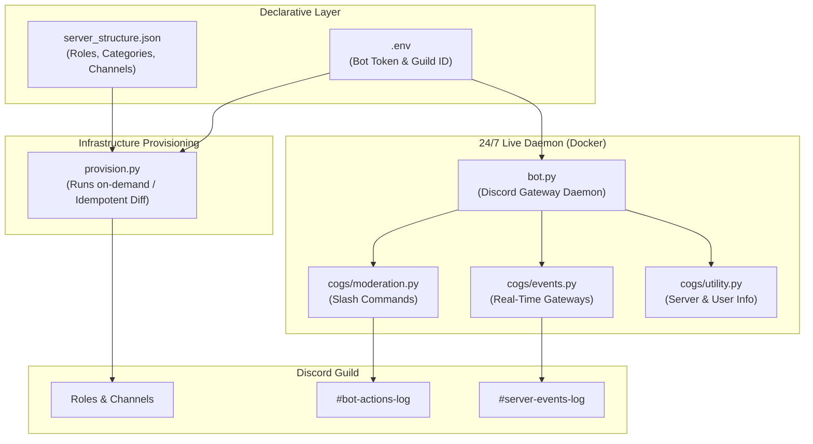

# 🛡️ ZARA — ZerXeus's Autonomous Role & Administration System

[](https://www.python.org/)
[](https://github.com/Rapptz/discord.py)
[](https://www.docker.com/)
[]()
[]()

> **ZARA** is a unified, production-ready (not really) Discord administration suite that pairs **Infrastructure-as-Code (IaC)** server provisioning with a **24/7 containerized moderation bot daemon**, dual-channel audit logging, and modern slash commands.

---

## 📑 Table of Contents

- [Architecture & Overview](#-architecture--overview)
- [Key Features](#-key-features)
- [Prerequisites & Discord Setup](#-prerequisites--discord-setup)
- [Configuration Schema](#-configuration-schema)
- [Running the IaC Provisioner](#-running-the-iac-provisioner)
- [Running the 24/7 Bot Daemon](#-running-the-247-bot-daemon)
  - [Option A: Docker Deployment (Recommended)](#option-a-docker-deployment-recommended)
  - [Option B: Local Python Execution](#option-b-local-python-execution)
- [Commands & Administration Manual](#-commands--administration-manual)
- [Troubleshooting & FAQ](#-troubleshooting--faq)

---

## 🏛️ Architecture & Overview

ZARA operates in two complementary modes within a single repository:

1. **IaC Provisioner (`provision.py`)**: Runs on-demand to idempotently create, update, and reconcile roles, categories, channels, and permission overwrites from `server_structure.json`.
2. **Live Daemon (`bot.py`)**: Runs 24/7 (natively or inside Docker) providing instant slash commands (`/kick`, `/ban`, `/timeout`, `/role`, etc.) and real-time dual audit logging (`#bot-actions-log` and `#server-events-log`).



---

## ✨ Key Features

- **⚡ True Idempotency:** Safely re-run `provision.py` at any time; existing roles and channels are skipped without duplicate creation.
- **🛡️ Rate-Limit & 429 Protection:** Built-in asynchronous request throttling (`0.5s`) prevents API rate-limiting.
- **🐳 Production Docker Containerization:** Deploy anywhere in seconds with `docker compose up -d` and auto-restart policies.
- **📁 Dual Audit Logging:**
  - `#bot-actions-log`: Command execution audit trails (who ran what command and why).
  - `#server-events-log`: Passive gateway stream (member joins/leaves, role changes, message edits/deletes, voice room activity).
- **🔨 Complete Moderation Slash Commands:** Full hierarchy-checked suite (`/kick`, `/ban`, `/unban`, `/timeout`, `/untimeout`, `/role add`, `/role remove`, `/purge`, `/slowmode`, `/lock`, `/unlock`).

---

## ⚙️ Prerequisites & Discord Setup

1. **Bot Creation & Token:**
   - Create an application in the [Discord Developer Portal](https://discord.com/developers/applications).
   - Create a Bot, reset its token, and save it.
2. **Privileged Gateway Intents (Required):**
   - Enable **Server Members Intent** and **Message Content Intent** on the Bot page.
3. **Invite Bot with Administrator Scope:**
   - In **OAuth2 -> URL Generator**, select `bot` scope with `Administrator` permissions.
4. **⚠️ Critical Role Hierarchy Requirement:**
   - In Discord Server Settings -> **Roles**, ensure the bot's role is dragged to the top of the role list (just below Server Owner).

---

## 📁 Configuration Schema

Copy `.env.example` to `.env`:
```powershell
cp .env.example .env
```
Populate `.env`:
```env
DISCORD_BOT_TOKEN=your_actual_bot_token_here
DISCORD_GUILD_ID=123456789012345678
```

---

## 🛠️ Running the IaC Provisioner

Whenever you modify `server_structure.json` to add or update channels and roles:

```powershell
# Validate configuration locally
python provision.py --validate-config

# Preview changes with dry-run simulation
python provision.py --dry-run

# Apply live server provisioning
python provision.py
```

---

## 🤖 Running the 24/7 Bot Daemon

### Option A: Docker Deployment (Recommended)

Run the bot 24/7 with automatic restart on reboot or crash:

```bash
# Build and start container in the background
docker compose up -d --build

# View live container logs
docker compose logs -f

# Stop container
docker compose down
```

### Option B: Local Python Execution

```powershell
# Activate virtual environment
.venv\Scripts\Activate.ps1

# Start the bot daemon
python bot.py
```

---

## 📖 Commands & Administration Manual

For complete command syntax, parameters, permission requirements, and audit log formatting, see the **[Commands Manual](docs/COMMANDS_MANUAL.md)**.

Quick summary of available slash commands:
- **Moderation:** `/kick`, `/ban`, `/unban`, `/timeout`, `/untimeout`, `/role add`, `/role remove`, `/purge`, `/slowmode`, `/lock`, `/unlock`
- **Information:** `/ping`, `/serverinfo`, `/userinfo`, `/help`

---

## 🔧 Troubleshooting & FAQ

| Issue / Error | Root Cause | Resolution |
| :--- | :--- | :--- |
| `Cannot moderate member: role is higher` | Target user has a higher or equal role in Discord. | Role hierarchy safety prevents moderating higher-ranked staff. |
| `Bot Actions Log: NOT FOUND` | Log channel `#bot-actions-log` was not created. | Run `python provision.py` to provision the logging channels. |
| `403 Forbidden on Command` | Bot lacks permissions for action (e.g. Kick/Ban). | Check bot role permissions and ensure bot role is higher in hierarchy. |
| `Message edit/delete events not logging` | Message Content intent disabled in Developer Portal. | Enable **Message Content Intent** in Discord Developer Portal. |

---

<div align="center">
  <b>ZARA Discord System — Maintained by ZerXeus</b>
</div>
