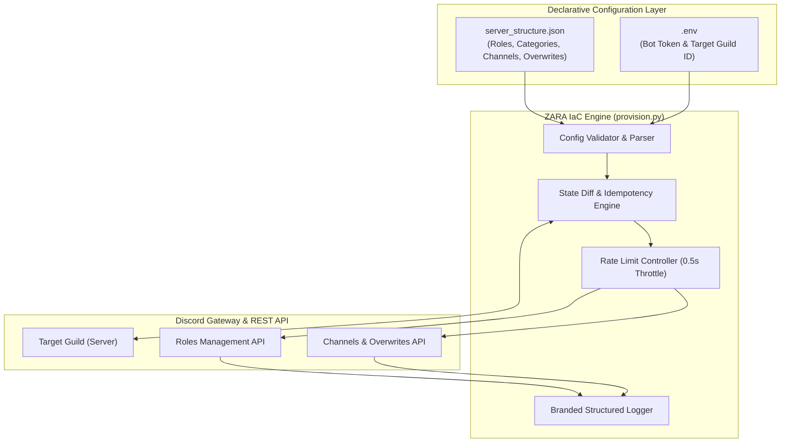

# 🛡️ ZARA — ZerXeus's Autonomous Role & Administration System

[](https://www.python.org/)
[](https://github.com/Rapptz/discord.py)
[]()
[]()

> **ZARA** is an idempotent, Infrastructure-as-Code (IaC) automation engine designed to provision, synchronize, and enforce Discord server architectures from structured JSON declarations.

---

## 📑 Table of Contents

- [Overview & Architecture](#-overview--architecture)
- [Key Features](#-key-features)
- [Prerequisites & Discord Setup](#-prerequisites--discord-setup)
  - [1. Create Discord Bot & Obtain Token](#1-create-discord-bot--obtain-token)
  - [2. Enable Gateway Intents](#2-enable-gateway-intents)
  - [3. Invite Bot to Target Server](#3-invite-bot-to-target-server)
  - [4. Discord Role Hierarchy Requirement](#4-critical-discord-role-hierarchy-requirement)
- [Configuration Schema (`server_structure.json`)](#-configuration-schema-server_structurejson)
- [Installation & Quickstart](#-installation--quickstart)
- [Usage & CLI Reference](#-usage--cli-reference)
- [Troubleshooting & Common Errors](#-troubleshooting--common-errors)
- [Repository & Remote Setup](#-repository--remote-setup)

---

## 🏛️ Overview & Architecture

ZARA brings software engineering and DevOps best practices (declarative configuration, immutability, automated diffing, and rate-limit aware provisioning) to Discord community and operations management.



---

## ✨ Key Features

- **⚡ True Idempotency:** ZARA queries the live server state prior to making modifications. If a role, category, or channel already matches the desired configuration, it is skipped without making redundant API calls.
- **🛡️ Rate-Limit & HTTP 429 Protection:** Integrates deliberate asynchronous throttling (`0.5s` between mutations) to prevent Discord API rate-limit penalties.
- **🔍 Dry-Run Simulation:** Preview exactly what resources will be created or modified using the `--dry-run` flag without making any live changes.
- **📋 Standalone Schema Validation:** Check your `server_structure.json` syntax and permission flags locally with `--validate-config`.
- **🔐 Granular Permission Overwrites:** Full support for category-level and channel-specific permission overrides (e.g. `@everyone`, `Administrator`, `Moderator`).
- **📊 Execution Summary Metrics:** Comprehensive terminal reporting detailing created, updated, and skipped resources.

---

## ⚙️ Prerequisites & Discord Setup

### 1. Create Discord Bot & Obtain Token
1. Navigate to the [Discord Developer Portal](https://discord.com/developers/applications).
2. Click **New Application**, give it a name (e.g., `ZARA Provisioner`), and accept the Terms of Service.
3. In the sidebar, select **Bot**.
4. Click **Reset Token** to generate a new bot token. Copy this token (you will paste it into your `.env` file).

### 2. Enable Gateway Intents
1. On the **Bot** page, scroll down to **Privileged Gateway Intents**.
2. Enable **Server Members Intent**.
3. Save changes.

### 3. Invite Bot to Target Server
1. In the sidebar, go to **OAuth2** -> **URL Generator**.
2. Under **Scopes**, select `bot`.
3. Under **Bot Permissions**, select `Administrator` (or individually select `Manage Roles`, `Manage Channels`, `View Audit Log`, `Send Messages`, `Manage Messages`).
4. Copy the generated URL at the bottom and open it in your browser to authorize and invite ZARA to your Discord server.

### 4. ⚠️ CRITICAL: Discord Role Hierarchy Requirement
Discord enforces a strict role hierarchy:
> **A bot cannot create, modify, or assign any role positioned higher than the bot's own highest role.**

After inviting your bot:
1. Open your Discord server settings -> **Roles**.
2. Locate the bot's role (e.g. `ZARA Provisioner`).
3. **Drag the bot's role to the top of the role list** (just below Server Owner).

---

## 📁 Configuration Schema (`server_structure.json`)

The server structure is defined in a standard JSON format:

```json
{
  "roles": [
    {
      "name": "Administrator",
      "color": "#E74C3C",
      "hoist": true,
      "mentionable": true,
      "permissions": [
        "administrator"
      ]
    },
    {
      "name": "Member",
      "color": "#2ECC71",
      "hoist": false,
      "mentionable": false,
      "permissions": [
        "view_channel",
        "send_messages",
        "read_message_history"
      ]
    }
  ],
  "categories": [
    {
      "name": "📌 INFORMATION",
      "overwrites": {
        "@everyone": {
          "view_channel": true,
          "send_messages": false
        },
        "Administrator": {
          "send_messages": true
        }
      },
      "channels": [
        {
          "name": "rules",
          "type": "text",
          "topic": "Server rules and conduct.",
          "slowmode_delay": 0
        },
        {
          "name": "announcements",
          "type": "announcement",
          "topic": "Official announcements."
        }
      ]
    },
    {
      "name": "🔊 VOICE CHANNELS",
      "channels": [
        {
          "name": "General Voice",
          "type": "voice",
          "user_limit": 0,
          "bitrate": 64000
        }
      ]
    }
  ]
}
```

### Supported Channel Types:
- `"text"`: Standard Discord text channel
- `"voice"`: Voice and video room
- `"announcement"`: News/announcement channel
- `"stage"`: Stage event channel

---

## 🚀 Installation & Quickstart

### Step 1: Create Virtual Environment
```powershell
# Create virtual environment
python -m venv .venv

# Activate virtual environment (Windows PowerShell)
.venv\Scripts\Activate.ps1

# Activate virtual environment (Linux/macOS)
source .venv/bin/activate
```

### Step 2: Install Dependencies
```bash
pip install -r requirements.txt
```

### Step 3: Configure Environment Variables
Copy `.env.example` to `.env`:
```powershell
cp .env.example .env
```
Edit `.env` with your actual credentials:
```env
DISCORD_BOT_TOKEN=MTA...your_real_bot_token...
DISCORD_GUILD_ID=123456789012345678
```

> 💡 *To find your Server ID:* Enable **Developer Mode** in Discord (`Settings -> Advanced -> Developer Mode`), then right-click your server icon and click **Copy Server ID**.

---

## 💻 Usage & CLI Reference

### 1. Validate Configuration (Offline Linting)
Validate syntax and permission keys without connecting to Discord:
```bash
python provision.py --validate-config
```

### 2. Dry-Run Simulation (Safe Preview)
Simulate synchronization against your live server without making API writes:
```bash
python provision.py --dry-run
```

### 3. Execute Live Provisioning
Run the live provisioning pipeline:
```bash
python provision.py
```

### 4. Custom Configuration File
Provide an alternative configuration file path:
```bash
python provision.py --config staging_server.json
```

---

## 🔧 Troubleshooting & Common Errors

| Error Message / Issue | Cause | Solution |
| :--- | :--- | :--- |
| `[ZARA - ERROR] Target Guild not found!` | Bot is not in the server or `DISCORD_GUILD_ID` is wrong. | Invite bot via OAuth2 link and verify the server ID in `.env`. |
| `[ZARA - WARN] Insufficient bot permissions / role hierarchy` | Bot's role is below the role it is trying to edit. | Go to Discord Server Settings -> Roles, and drag the Bot role to the top. |
| `discord.errors.Forbidden: 403 Forbidden` | Missing required permissions. | Ensure the Bot has `Administrator` or `Manage Roles` + `Manage Channels`. |
| `discord.errors.LoginFailure: Improper token` | The `DISCORD_BOT_TOKEN` in `.env` is invalid or expired. | Reset bot token in Developer Portal and update `.env`. |

---

## 📦 Repository & Remote Setup

To push this repository to your GitHub account:

```powershell
# 1. Add your GitHub remote repository URL
git remote add origin https://github.com/<YOUR_USERNAME>/<YOUR_REPOSITORY>.git

# 2. Rename branch to main (if not already main)
git branch -M main

# 3. Push initial commit to GitHub
git push -u origin main
```

---

<div align="center">
  <b>Built with ❤️ by ZerXeus | ZARA Discord IaC</b>
</div>
